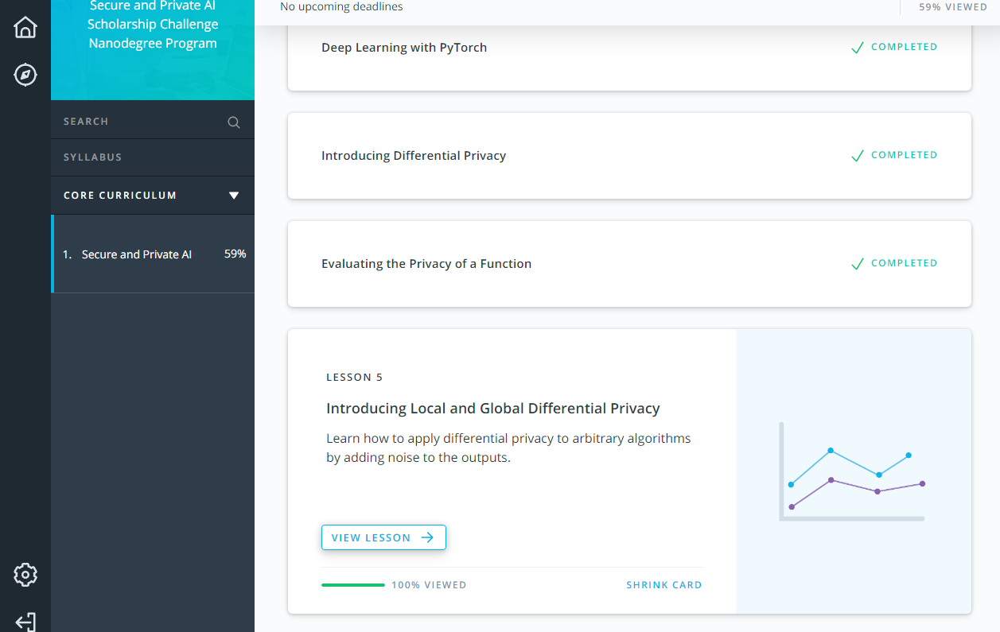

# Secure-Private-AI-Facebook-Scholarship-KeyStone-project
Secure &amp; Private AI Facebook Scholarship-KeyStone project

[image1]: ./images/courseProgress.png
[image2]: ./images/LaTexCode.png
[image3]: ./images/overleaf.png 

### Day 1: 
#### Polarbeargo
Gather a group of enthusiasts and engage in a group-project that would be based on your learnings in the program. (need not be restricted to the program learnings)   
Collabortors:  

https://github.com/Polarbeargo     
https://github.com/Harkirat155     
https://github.com/ahkhalwai     
https://github.com/sfmajors373 

Finish audit Securing Federated Learning and Encrypted Deep Learning 
![][image1]
continue read PySyft repository and following great refrences:    
* https://www.cis.upenn.edu/~aaroth/Papers/privacybook.pdf    
* https://arxiv.org/pdf/1607.00133.pdf

Learn use overleaf and Visual Studio code write and compile LaTex in Robotic inference project write up report:
![][image2]
![][image3]

#### Sarah Majors
Complete 6.4 and 6.5 of Udacity course.  Also make a pacman package for PySyft since it is not in the AUR yet.

#### Halwai Aftab Hasan
Finish Lesson 5 - Introducing Local and Global Differential Privacy 

Finish Mumbai Meet-Up plan, day and Time with Jyoti, Shubhangi, Avi ,Cibaca, Hitoishi and Amar

